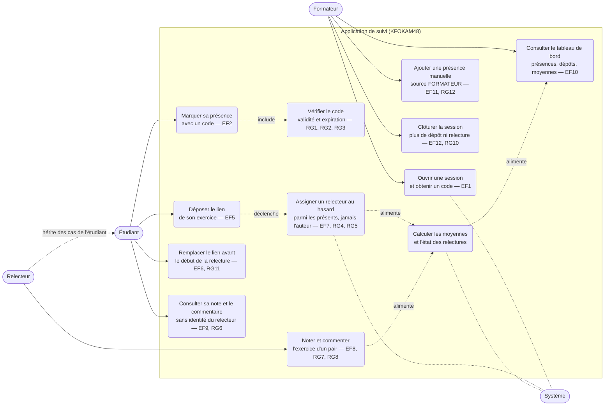

# D1 — Diagramme de cas d'utilisation

Source : `docs/CAHIER_DES_CHARGES.md` (§2 Acteurs, §4 Exigences fonctionnelles EF1–EF12).

Lecture :

- Le **relecteur** est un étudiant désigné automatiquement (EF7) : il hérite des cas de l'étudiant et ajoute la relecture.
- Le **système** est acteur des cas automatiques : génération du code, assignation au hasard, calcul des moyennes.
- La clôture (EF12) et l'expiration du code (RG1/RG2) sont les deux bornes temporelles distinctes tranchées au §7 du cahier des charges.
