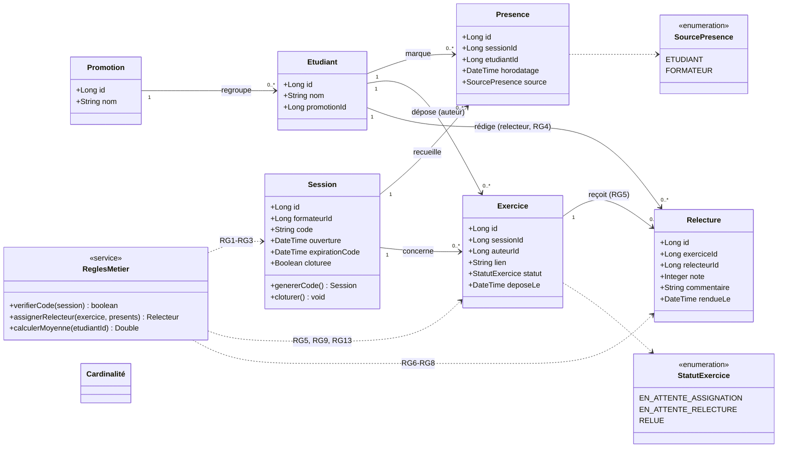

# D2 — Diagramme de classes

Source : `docs/CAHIER_DES_CHARGES.md` (§4, §6) et endpoints du contrat `api/contrat.yaml` à compléter. Les statuts d'exercice reprennent EF5, RG9 et RG13.

Points de vigilance repris des règles de gestion :

- `Relecture.relecteurId` n'est **jamais** exposé à l'étudiant relu (RG6) — c'est une contrainte de la couche DTO, pas du schéma.
- `Exercice.statut` traverse les trois états d'EF5/RG9/RG13 ; le remplacement du lien (EF6/RG11) n'est possible que depuis `EN_ATTENTE_ASSIGNATION` et `EN_ATTENTE_RELECTURE`.
- `Session.cloturee` bloque dépôt et relecture (EF12/RG10), alors que `expirationCode` ne bloque que la présence (RG1/RG2) — distinction tranchée au §7.
- `Promotion` et `Etudiant` sont hors périmètre de création (supposés préexistants), d'où l'attribut `promotionId` minimal.
