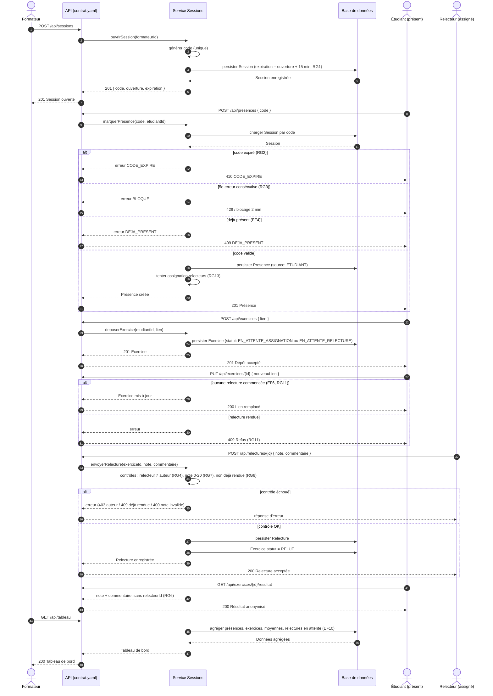
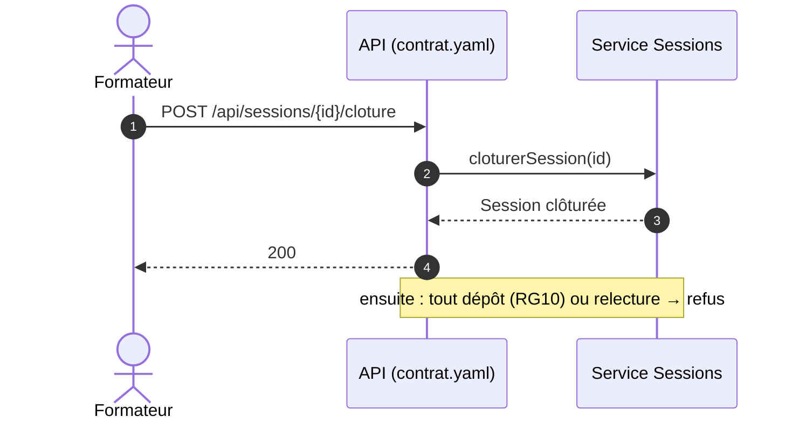

# D3 — Diagramme de séquence

Scénario nominal complet : ouverture de session, présence de l'étudiant, dépôt d'exercice, assignation du relecteur, relecture et consultation. Dérivé de EF1–EF10 et RG1–RG9.

Alternative de clôture (EF12) :

