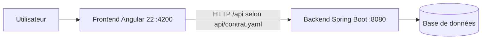

# Diagrammes

Déposer ici les diagrammes du projet, un fichier par diagramme.

- Formats admis : Mermaid (`.md` ou `.mmd`) ou PlantUML (`.puml`).
- Convention de nommage : `<type>-<sujet>.<ext>` (ex. `sequence-authentification.md`).

| Type | Sujet | Statut |
|---|---|---|
| Contexte | Acteurs et systèmes externes | À faire |
| Cas d'utilisation | Périmètre fonctionnel | À faire |
| Séquence | Flux principaux (un par cas d'usage clé) | À faire |
| Classes / Modèle de données | Entités du domaine | À faire |
| Déploiement | Environnements | À faire |

## Architecture cible (exemple)

